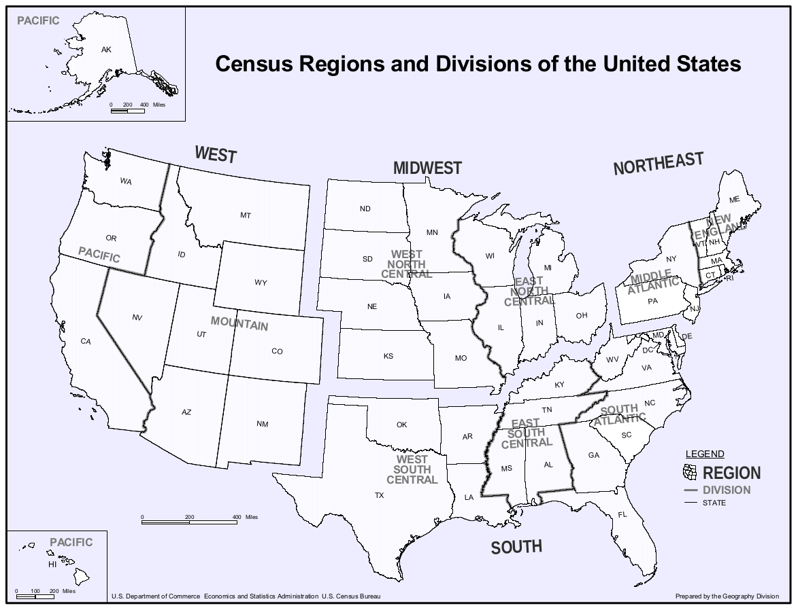
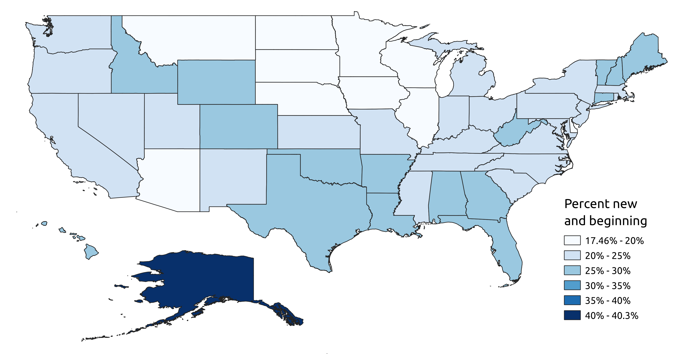
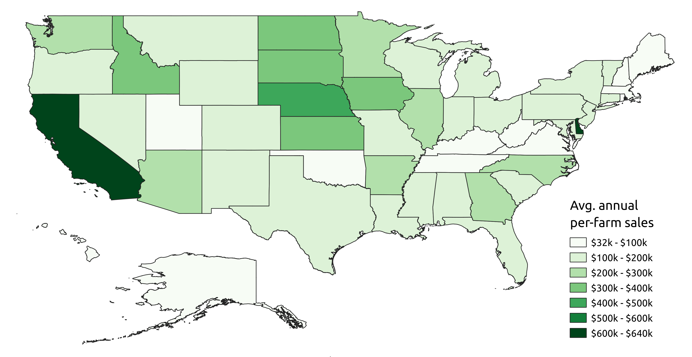
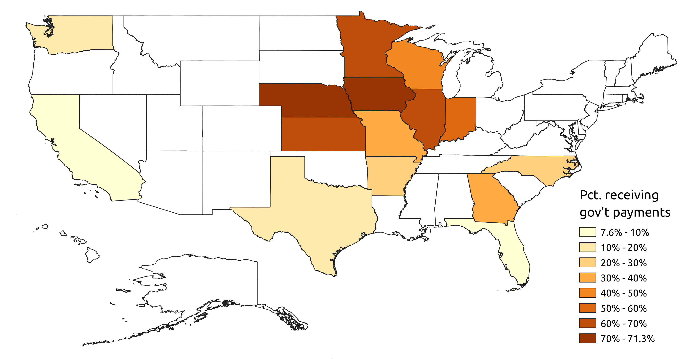
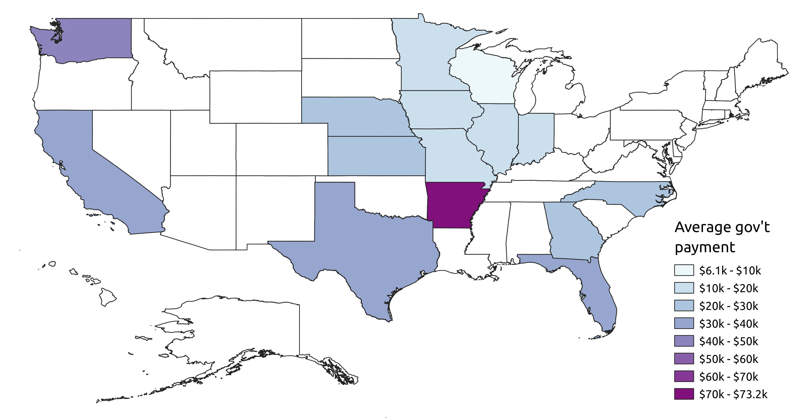

*Note:* This document is called an R markdown notebook.  It should provide a nice visual way for me to show the steps I took to complete the exercise, including code, figures, and explanations.  

## Workflow setup

I began by setting up the basic elements of my workflow.  I created a [Github repository](https://github.com/swiltshire/fsrc_data_sci_exercise) to store the data, code, and output figures I will eventually generate.  I then set up a new project in RStudio and cloned the repository so I can periodically "push" the work I'm doing on my local machine to the Github cloud.  This is especially important for collaborative work, but I find it useful for solo projects as well, since it provides an easy way both back up and share my work, as well as storing a history of changes over time.  I set up a directory structure, my gitignore file, and a scratchpad to experiment with code.  Before going any further, I performed the "initial commit" to save this basic structure to the repo.


## Exercise 1

### Gathering raw data

The first step was to compile the raw data needed for the analysis.  I pulled up the [USDA NASS quickstats portal](https://quickstats.nass.usda.gov/?source_desc=CENSUS), which allows the user to query the database.  I set up a query which filtered data to show only 2017 NASS Census of Agriculture, at the state geographic level.  

Since we are interested in new and beginning farmers, which the [USDA defines](https://www.nass.usda.gov/Publications/Highlights/2020/census-beginning%20-farmers.pdf) as farmers with 10 or fewer years of experience, the first datapoint I was interested in is the primary producer’s “Years on any operation.” I filtered to search only within the demographics sector and producers group.  The census results divide this into three categories: less than 6 years, 6 to 10 years, and 11 or more years.  I downloaded the appropriate 150 records (3 for each state) as a spreadsheet file.  

I chose to focus on question 3: *”How does the extent of new and beginning farmers in a state relate to the agricultural production of a state (e.g. yield levels)?*”  So, the next step was to download some data on production by state from the Census.  For this quick analysis, I needed to pick a simple indicator of agricultural production (by farm, in this case).  While many more complex potential indicators are contained in this giant dataset, for example breaking farms down according to bushels of specific products, for this exercise I needed a high-level indicator to explore very general trends.  I chose to use average total sales of all agricultural products.  Of course, this could be problematic to some extent since different products are valued differently, but it will serve to illustrate the methodology.  I separately queried the database for total crop sales by state, and total animal sales (including animal products) by state, and downloaded each as a spreadsheet.

Finally, I opened each spreadsheet in Excel and deleted all columns except for state name, data category, and value.  I copied these files into my R project.


### Setting up my IDE

With the three raw spreadsheets copied into my R Studio environment, it was time to do some coding.  This R notebook format allows me to show my code in "chunks," with the output generated by the code following each chunk.  

An initial step in any coding project is to load the required libraries or packages.  In this case, I will be using the *tidyverse*, which includes many useful functions to manipulate and plot data.  I also set up some global options to make the plots look nice.

```{r, results = F}
rm(list = ls()) # clear environment (good coding practice)

library(tidyverse)
library(RColorBrewer)
library(ggthemes)
library(hrbrthemes)
ggplot2::theme_set(hrbrthemes::theme_ipsum_rc())
ggplot2::theme_update(plot.title = element_text(size = 14),
                      axis.title.x = element_text(size = 12),
                      axis.title.y = element_text(size = 12),
                      legend.text = element_text(size = 11))
knitr::opts_chunk$set(echo = T, fig.width = 7, fig.height = 5)

```


### Combining census data

The first goal is to combine the three raw csvs of census data into one a single data structure in R (using a *tibble* here), keeping only the relevant data.  I read in the raw files, specifying formatting for each column.  Then I transformed the data on number of farmers in each of the three experience categories into a single value indicating the percent of farmers in each state with 10 or fewer years of experience.  This required some data manipulation, including recoding, pivoting, and calculating new columns.  Next I merged the crop and animal sales data and calculated total sales.  Finally, I merged the farmer experience and sales data, and calculated average sales per farm.

```{r}

# load raw csvs and set column formatting
prod_n_yrs <- read.csv("raw_data/2017_census/prod_n_yrs.csv", 
                       header = T, sep = ",", colClasses = c('character','character','numeric'))
crop_sales <- read.csv("raw_data/2017_census/crop_sales.csv", 
                       header = T, sep = ",", colClasses = c('character','numeric'))
animal_sales <- read.csv("raw_data/2017_census/animal_sales.csv", 
                         header = T, sep = ",", colClasses = c('character','numeric'))

# manipulate prod_n_yrs to generate new tibble with pct new/beginning farmers by state
pct_new <- prod_n_yrs %>%
  mutate(Data.Item = 
           recode(Data.Item, # recode experience categories so it's easier to read
                  'PRODUCERS, PRIMARY, YEARS ON ANY OPERATION, LT 6 YEARS - NUMBER OF PRODUCERS' = 'LT_6',
                  'PRODUCERS, PRIMARY, YEARS ON ANY OPERATION, 6 TO 10 YEARS - NUMBER OF PRODUCERS' = '6_to_10',
                  'PRODUCERS, PRIMARY, YEARS ON ANY OPERATION, GE 11 YEARS - NUMBER OF PRODUCERS' = 'GE_11')) %>%
  pivot_wider(names_from = Data.Item, values_from = Value) %>% # pivot wider so each state is one row
  mutate(n_new = `LT_6` + `6_to_10`, # new/beginning farmers are all those with 10 or fewer years experience
         n_exp = `GE_11`, # experienced farmers are those with 11 or more years
         n_total = n_new + n_exp, # total number of farmers is n_new + n_exp
         pct_new = 100 * n_new / n_total # new/beginning farmer percentage
  ) %>%
  select(State, n_total, pct_new) # select only relevant columns

# generate tibble with combined sales by state
total_sales <- merge(crop_sales, animal_sales, by = 'State') %>%
  mutate(total_sales = Value.x + Value.y) %>% # total sales = crops + animals
  select(State, total_sales) # select only relevant columns

# generate tibble with combined census data
comb_census_data <- merge(pct_new, total_sales, by = 'State') %>%
  mutate(avg_sales = total_sales / n_total, # average sales per farm
         State = str_to_title(State)) # Convert state names from all caps to title case

comb_census_data # show table below chunk

```


### Plotting census data

For an initial exploration of the data, I opted to produce a couple quick scatter plots to see if there is a visual relationship between the percent of new and beginning farmers in a state, and the average sales in that state.  I used ggplot to produce these rough and ready visualizations.

```{r}

comb_census_data %>%
  ggplot(aes(x = pct_new, y = total_sales)) +
  geom_point()

```


```{r}

comb_census_data %>%
  ggplot(aes(x = pct_new, y = avg_sales)) +
  geom_point()

```


From these quick plots, it appears that there may indeed be some correlation between the percent of new and beginning farmers in a state and sales figures for agricultural products.  This visual correlation appears especially apparent when we plot the average sales per farm against the percent of new and beginning farmers in each state.  To dig into this further, I fit linear models to the data.  I also formatted the plots and labels to be "production ready."


```{r}

comb_census_data <- comb_census_data %>% mutate(total_sales_bil = total_sales/1000000000) # convert sales data to billions of dollars

lm_total_sales <- lm(pct_new ~ total_sales_bil, comb_census_data) # run linear regression model

# generate text for line formula, r squared, and p value on plot
plt_txt_total_sales <- substitute(italic(y) == a - b %.% italic(x)*","~~italic(r)^2~"="~r2*","~~italic(p)~"="~pv, 
                                list(a = format(unname(coef(lm_total_sales)[1]), digits = 2),
                                     b = format(unname(-coef(lm_total_sales)[2]), digits = 2),
                                     r2 = format(summary(lm_total_sales)$r.squared, digits = 3),
                                     pv = format(summary(lm_total_sales)$coefficients[2,4], digits = 3)))

# create plot with regression line, formula, p, and r squared value
comb_census_data %>%
  ggplot(aes(x = pct_new, y = total_sales_bil)) +
  geom_point() +
  geom_line(stat = 'smooth', method = 'lm', formula = y ~ x, linewidth = 1, alpha = .6) +
  geom_text(x = 34, y = 37.5, label = as.character(as.expression(plt_txt_total_sales)), parse = T, size = 3.5) +
  scale_x_continuous(expand = expansion(mult = c(.01, .01))) +
  scale_y_continuous(limits = c(-5,50), expand = expansion(mult = c(.01, .01))) +  
  labs(title = "Percent new farmers vs. statewide farm sales",
       x = "New and beginning farmers (%)",
       y = "Annual statewide farm sales ($ \u00D7 1 billion)")

```

```{r}

comb_census_data <- comb_census_data %>% mutate(avg_sales_thou = avg_sales/1000) # convert sales data to thousands of dollars

lm_avg_sales <- lm(pct_new ~ avg_sales_thou, comb_census_data) # run linear regression model

# generate text for line formula, r squared, and p value on plot
plt_txt_avg_sales <- substitute(italic(y) == a - b %.% italic(x)*","~~italic(r)^2~"="~r2*","~~italic(p)~"="~pv, 
                                list(a = format(unname(coef(lm_avg_sales)[1]), digits = 2),
                                     b = format(unname(-coef(lm_avg_sales)[2]), digits = 2),
                                     r2 = format(summary(lm_avg_sales)$r.squared, digits = 3),
                                     pv = format(summary(lm_avg_sales)$coefficients[2,4], digits = 3)))

# create plot with regression line, formula, p, and r squared value
comb_census_data %>%
  ggplot(aes(x = pct_new, y = avg_sales_thou)) +
  geom_point() +
  geom_line(stat = 'smooth', method = 'lm', formula = y ~ x, linewidth = 1, alpha = .6) +
  geom_text(x = 34, y = 450, label = as.character(as.expression(plt_txt_avg_sales)), parse = T, size = 3.5) +
  scale_x_continuous(expand = expansion(mult = c(.01, .01))) +
  scale_y_continuous(limits = c(-75,650), expand = expansion(mult = c(.01, .01))) +
  labs(title = "Percent new farmers vs. average farm sales, by state",
       x = "New and beginning farmers (%)",
       y = "Average annual sales per farm ($ \u00D7 1,000)")

```


### Analysis by region

To tease out spatial trends in the data, I added geographical regions to the dataset.  I used the [US Census Bureau system of regions and divisions](https://www2.census.gov/geo/pdfs/maps-data/maps/reference/us_regdiv.pdf).  Regions are less granular (4 regions total), and divisions more granular (9 regions).  These are displayed in the figure below.  

{width=100%}

I found a [table](https://github.com/cphalpert/census-regions/blob/master/us%20census%20bureau%20regions%20and%20divisions.csv) with these regions and divisions, downloaded it, imported it into my R environment, and merged it with the existing dataset.  

```{r}

us_reg_div <- read.csv('raw_data/us census bureau regions and divisions.csv') %>% select(-State.Code)

comb_census_data <- merge(comb_census_data, us_reg_div, by = "State")

# set factor order for plots
comb_census_data$Region <- factor(comb_census_data$Region, levels = c("South", "West", "Midwest", "Northeast"))

comb_census_data # show table below chunk

```

I decided to simply focus on the four regions for this analysis.  First I calculated averages by region by grouping and summarizing the dataset.

```{r}

comb_census_data_by_region <- comb_census_data %>%
  group_by(Region) %>%
  summarise_at(c('pct_new', 'total_sales_bil', 'avg_sales_thou'), mean)

comb_census_data_by_region # show table below chunk

```

From this analysis, we can see that the Midwest region has the lowest percentage of new and beginning farmers, by far the highest sales per state, and also the highest average sales per farm.  The other three regions have similar average percentages of new and beginning farmers.  The Northeast region has the lowest average sales per farm and by far the lowest average per state, although this makes sense since states are smaller in the Northeast.  

Next I reproduced the above plot of new and beginning farmers vs. average farm sales, but this time changing the color and shape of scatter points by geospatial region.  I used both color and shape to make the plot readable for colorblind people.

```{r}

# create plot with regression line, formula, p, and r squared value
comb_census_data %>%
  ggplot(aes(x = pct_new, y = avg_sales_thou)) +
  geom_point(aes(col = Region, shape = Region)) +
  geom_line(stat = 'smooth', method = 'lm', formula = y ~ x, linewidth = 1, alpha = .6) +
  geom_text(x = 32.5, y = 450, label = as.character(as.expression(plt_txt_avg_sales)), parse = T, size = 3.5) +
  scale_x_continuous(expand = expansion(mult = c(.01, .01))) +
  scale_y_continuous(limits = c(-75,650), expand = expansion(mult = c(.01, .01))) +
  scale_color_manual(values = brewer.pal(4, "Dark2")) +
  labs(title = "Percent new farmers vs. average farm sales, by state",
       x = "New and beginning farmers (%)",
       y = "Average annual sales per farm ($ \u00D7 1,000)")

```

#### Outliers

It appears that there are three prominent outliers in the data.  Let's try to determine what's going on with those states.  

```{r}

comb_census_data %>%
  filter(Region == "South" & avg_sales_thou > 600) %>%
  pull(State)

comb_census_data %>%
  filter(Region == "West" & avg_sales_thou > 600) %>%
  pull(State)

comb_census_data %>%
  filter(Region == "West" & pct_new > 40) %>%
  pull(State)

```
It appears that Alaska is an outlier in that it has by far the highest number of new and beginning farmers.  California and Delaware both have very high per-farm sales numbers.  These results are discussed below.


### Discussion

These analyses show that the percent of new and beginning farmers in each state explains almost twenty percent of the variability between states in per-farm sales, and almost ten percent of the variability in total statewide sales.  Both of these results are statistically significant.  This means that states with higher percentages of farmers with long-term experience typically generate more agricultural cash-flow, both on a statewide and a per-farm basis.  While further analyses are required to determine the reasons for these regional disparities, several hypotheses spring to mind.  

One hypothesis could be that farmers with more experience are simply more likely to make sound financial decisions, leading to higher sales figures.  However, the situation is likely more complex.

Farms which have existed for a long time are more likely to have scaled up over the years, boosting sales numbers.  This could be especially true when considering issues of generational land tenure.  In most regions, access to productive land for newer farmers can be challenging, to say the least.  Similar issues exist for capital investments: farmers with more seasons under their belts are more likely to have invested in larger and more modern machinery, boosting their production.

Additionally, it is likely that there is some survivorship bias in the data, since farmers with sales levels too low to support their operations are more likely to go out of business early in their careers and perhaps get out of farming entirely.  Any farmer that has survived for over ten years is probably bringing in quite a bit of revenue.  

From a geospatial perspective, there is notable variability between the four major regions of the US, with the open geography and fertile soils of the midwest leading to the highest per-farm sales, and the tight mountains and valleys of the northeast leading to smaller farms and lower per-farm sales.  The midwest also has the most experienced farmers, with less than 20% having under ten years of experience.  It is likely that the multi-generational farming culture of the midwest has led to these results.  

Meanwhile, the western region has the highest proportion of new farmers, at over 25%.  Perhaps the availability of massive land resources in the west has allowed new farmers to set up operations more easily there.  The western region also shows high per-farm sales, although California skews the data on farm sales in the region upward.  California is an outlier nationally, being characterized by many large and productive farms in the central and Salinas valleys, although its productivity is contingent on water resources, which have become more variable with climate change.  

On the other hand, Alaska skews the percentage of new farmers in the western region upward, having by far the highest level of new and beginning farmers of any state at over 40%.  I do not know the reason for this, but one could hypothesize that trends toward milder summer climates in the state may be incentivizing new farmers to "stake a claim" in these northern lands.  

Finally, while the south ranks in the middle of the pack for both new farmers and sales figures, Delaware represents an interesting outlier, having both extremely low levels of new farmers and extremely high per-farm sales, with relatively few farms overall at just over 2,000.  With development pressure from eastern seabord cities such as Philadelphia, Baltimore, and Washington DC, perhaps Delaware, which has historically been an agricultural state, has simply become unaffordable for new farmers, leaving only experienced farmers with access to family land to thrive there.  

Overall, these analyses sketch an interesting picture, but a fuller understanding of the connections between farmers' experience levels and their revenues would frankly require deeper statistical analyses of other covariates that are beyond the scope of this exercise.


## Exercise 2

### Gathering and formatting raw data

To gather the raw ARMS data, I used the [Tailored reports: Farm Structure and Finance](https://my.data.ers.usda.gov/arms/tailored-reports) feature of the USDA ERS website.  I queried the system for a custom report on government payments for each state in the survey in the year 2017 (same year as the Census), and downloaded the csv.  I then used Excel to prepare the csv for import into R by removing unnecessary header lines and metadata, modifying column headers to remove the "/ Estimate" text, and finally transposing rows and columns to match the format of the census dataset.  I opted to keep three columns for analysis: "Farms receiving government payments," "Farms not receiving government payments," and "Government payments, participants."  I renamed the columns to be more parsimonious for analysis in R.


### Loading data into R

Like the Census data, the first step was to load the ARMS data into my R environment.  

```{r}

arms_data <- read.csv("raw_data/2017_arms/gov_payments.csv", 
                       header = T, sep = ",", colClasses = c('character','numeric','numeric','numeric'))

```

### Merging ARMS and Census data

Next I merged the existing Census data with the ARMS data.  Note that there are only 15 rows in this new dataset, since only 15 states were included in the ARMS survey.  I used the n_payments and n_no_payments columns to calculate a new column for percent of farms receiving payments, and then selected only the relevant columns.  

```{r}

comb_arms_census_data <- merge(comb_census_data, arms_data, by = 'State') %>%
  mutate(pct_gov_pay = 100 * n_payments / (n_payments + n_no_payments)) %>%
  select(-c(n_payments, n_no_payments))

comb_arms_census_data # show table below chunk

```

### Plotting ARMS data against Census data

Similar to the process above, I started by simply plotting the percent of new and beginning farmers in each state against the percent receiving government payments, and the average payment per farm.  My goal was to quickly plot the data with no frills to assess whether this is a valuable line of inquiry.

```{r}

comb_arms_census_data %>%
  ggplot(aes(x = pct_new, y = pct_gov_pay)) +
  geom_point()

```


```{r}

comb_arms_census_data %>%
  ggplot(aes(x = pct_new, y = avg_gov_pay)) +
  geom_point()

```


Again, it appears visually that two trends may exist, with states in which a higher percent of farms received government payments typically having more experienced farmers, and states in which average government payments were higher having more new and beginning farmers.

To check these correlations, I ran linear regressions on the data.  I produced similar plots as above, showing trend lines, $r^2$ coefficients, and p values.  I also plotted the geospatial regions in different colors and shapes.  Note that in the ARMS data no Northeast states are represented.  This seems to be a fairly major flaw in the dataset.

```{r}

lm_pct_gov_pay <- lm(pct_new ~ pct_gov_pay, comb_arms_census_data) # run linear regression model

# generate text for line formula, r squared, and p value on plot
plt_txt_pct_gov_pay <- substitute(italic(y) == a - b %.% italic(x)*","~~italic(r)^2~"="~r2*","~~italic(p)~"="~pv, 
                                list(a = format(unname(coef(lm_pct_gov_pay)[1]), digits = 2),
                                     b = format(unname(-coef(lm_pct_gov_pay)[2]), digits = 2),
                                     r2 = format(summary(lm_pct_gov_pay)$r.squared, digits = 3),
                                     pv = format(summary(lm_pct_gov_pay)$coefficients[2,4], digits = 3)))

# create plot with regression line, formula, p, and r squared value
comb_arms_census_data %>%
  ggplot(aes(x = pct_new, y = pct_gov_pay)) +
  geom_point(aes(col = Region, shape = Region)) +
  geom_line(stat = 'smooth', method = 'lm', formula = y ~ x, linewidth = 1, alpha = .6) +
  geom_text(x = 26, y = 55, label = as.character(as.expression(plt_txt_pct_gov_pay)), parse = T, size = 3.5) +
  scale_x_continuous(expand = expansion(mult = c(.01, .01))) +
  scale_y_continuous(limits = c(0,NA), expand = expansion(mult = c(.01, .01))) +
  scale_color_manual(values = brewer.pal(4, "Dark2")) +
  labs(title = "Percent new farmers vs. percent receiving government payments, by state",
       x = "New and beginning farmers (%)",
       y = "Farms receiving government payments (%)")

```


```{r}

comb_arms_census_data <- comb_arms_census_data %>% mutate(avg_gov_pay_thou = avg_gov_pay/1000) # convert payment data to thousands of dollars

lm_avg_gov_pay <- lm(pct_new ~ avg_gov_pay_thou, comb_arms_census_data) # run linear regression model

# generate text for line formula, r squared, and p value on plot
plt_txt_avg_gov_pay<- substitute(italic(y) == a - b %.% italic(x)*","~~italic(r)^2~"="~r2*","~~italic(p)~"="~pv, 
                                list(a = format(unname(coef(lm_avg_gov_pay)[1]), digits = 2),
                                     b = format(unname(-coef(lm_avg_gov_pay)[2]), digits = 2),
                                     r2 = format(summary(lm_avg_gov_pay)$r.squared, digits = 3),
                                     pv = format(summary(lm_avg_gov_pay)$coefficients[2,4], digits = 3)))

# create plot with regression line, formula, p, and r squared value
comb_arms_census_data %>%
  ggplot(aes(x = pct_new, y = avg_gov_pay_thou)) +
  geom_point(aes(col = Region, shape = Region)) +
  geom_line(stat = 'smooth', method = 'lm', formula = y ~ x, linewidth = 1, alpha = .6) +
  geom_text(x = 21, y = 55, label = as.character(as.expression(plt_txt_avg_gov_pay)), parse = T, size = 3.5) +
  scale_x_continuous(expand = expansion(mult = c(.01, .01))) +
  scale_y_continuous(limits = c(0,NA), expand = expansion(mult = c(.01, .01))) +
  scale_color_manual(values = brewer.pal(4, "Dark2")) +
  labs(title = "Percent new farmers vs. average government payment, by state",
       x = "New and beginning farmers (%)",
       y = "Average government payment ($ \u00D7 1,000)")

```

These analyses show that, indeed, there are statistically significant trends in the data in both cases.  The percent of farmers receiving government payments explains over 60% of the variability in the percent of farmers receiving government payments by state.  Further, the percent of new farmers explains almost 30% of the variability in the average payment amount (among farmers receiving payments).  


### GIS plots

Since we have discovered spatial clustering in the data, I thought it would be informative to plot the data on a map.  I first needed to output the data from R in a format that can be loaded into GIS software.  I will output two files here, one for just the Census data (which includes all 50 states), and the other with the combined ARMS and Census data.

```{r}

write.csv(comb_census_data, file = 'processed_data/comb_census_data.csv', row.names = F)
write.csv(comb_arms_census_data, file = 'processed_data/comb_arms_census_data.csv', row.names = F)

```

To create the figures, I used QGIS (an open source alternative to ESRI ArcGIS).  First I needed to import an open source shapefile with US state boundaries, which I found on the [US Census website](https://www.census.gov/geographies/mapping-files/time-series/geo/carto-boundary-file.html).  I then imported the two data files I exported from R.  I joined the tabular files to the shapefile, matching on the state name.  I then set up the symbology to show differences between states clearly.  I made a new layout to export the images.  I had to use three maps, one with the lower 48 states, one with Alaska, and one with Hawaii, which I fit together on the page.  I then added a legend, and exported the image.  I repeated this process for each of the four maps, being careful to maintain a consistent layout across all four, and changing the color ramps for some visual interest.  The four exported GIS visualizations appear below.

{width=100%}
{width=100%}
{width=100%}
{width=100%}

### Discussion

The data show that states in the ARMS survey in which there is a higher proportion of farms receiving government payments typically had fewer new and beginning farmers.  These states are clustered in the midwest region.  For a more complete analysis it would be important to examine the types of crops and animal products these farms are producing (which may receive different levels and mechanisms of government payments).  However, we do know that it is often easier for large-scale farms producing primarily a single product (eg. feed corn) to apply for and receive government payments than smaller, more diversified operations.  Further, there may be a gap in knowledge of government programs among newer farmers.

However, despite fewer farmers receiving payments in states with higher numbers of beginning farmers, the payments received by those participating in these government programs are actually higher in these states.  This suggests that government payment programs in which new and beginning farmers typically participate can be quite generous.  Again, this suggests that these government programs do represent an effective solution to help beginning farmers survive their first ten seasons, but that perhaps more outreach through extension services and other mechanisms is needed to better inform new farmers about these opportunities.  

Exploring the data spatially, we find that the midwest region stands out in several important ways.  Overall, the midwest has relatively few new and beginning farmers.  Revenues per farm are typically higher than the national average.  In these states, the majority of farmers receive some form of government payments, which is not the case for the rest of the country.  However, the amount payed out to each farm in most midwest these states is relatively modest.  An exception to this is Arkansas, in which government payments are the highest out of the states represented in the ARMS survey data.  Exploring why Arkansas farmers receive higher payments would be a very interesting avenue for future research.  

Overall, this excercise has provided an interesting glimpse into the connections between years of farmer experience, farm sales, and government payments.  We have shown several statistically-significant trends in the data which link these factors in interesting ways.  We have also shown how these outcomes cluster spatially by region, likely due to the primary types and methods of agriculture practiced in each region, climate variability between regions, and socio-historical factors like traditions of multi-generational farming.  In some ways this analysis has posed more questions than it has answered, but I suppose that is the nature of complex social-ecological systems.  I look forward to digging deeper into these types of data-driven analyses going forward if I am offered the Data Scientist position with the FSRC.  Thank you for your time!  It's been a fun exercise.

